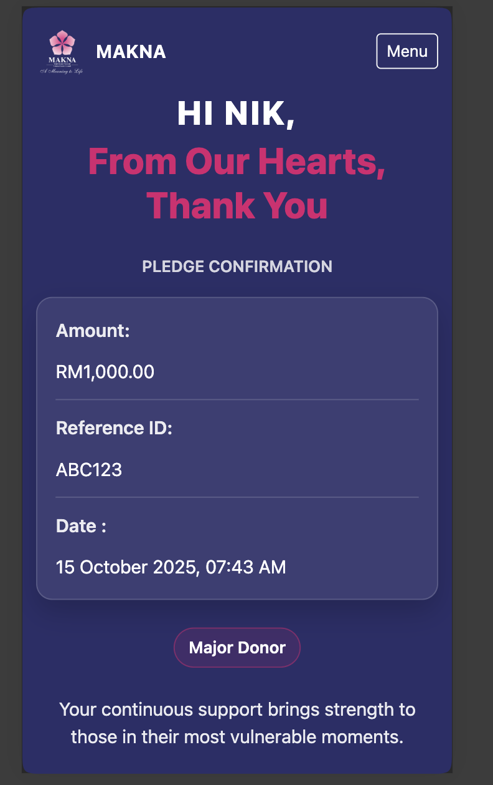
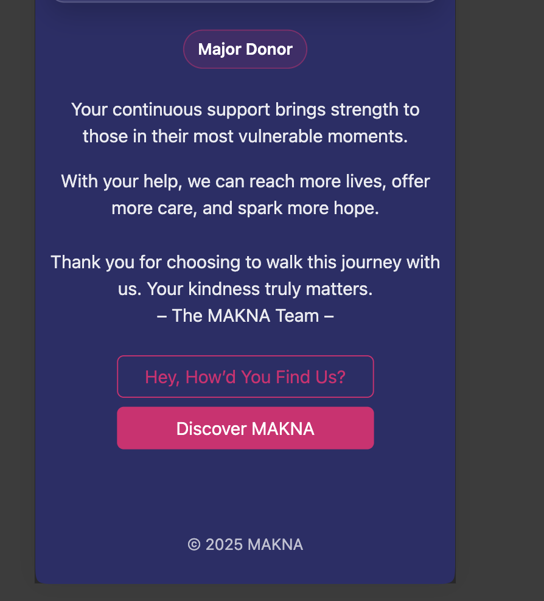

# MAKNA – WordPress Assessment (Task 1 & 2)

## Preview

## Contents
- `theme/functions.php`  
  Implements:
  - `get_donor_name()` — reads `varName`
  - `get_donor_amount()` — reads `FloatAmount` and formats `RMxx.xx`
  - `get_donation_type($amount)` — Contributor / Supporter / Major Donor
  - `shortcode_donor_refID()` — reads `ref_id`
- `theme/index.php`  
  Bootstrap confirmation page that renders dynamic values.
- `theme/makna-confirmation.css`  
  External CSS with the color system & layout.

## How to run (local)
1. Copy the files in `theme/` into your active theme folder  
   (`wp-content/themes/your-theme/`).
2. Visit (example):  
   `/?FloatAmount=88&varName=Monkey%20D%20Luffy&ref_id=abABq123&frequency=Monthly`
3. You should see:
   - Name in the hero (“HI MONKEY D LUFFY,”)
   - Amount: `RM88.00 / Monthly`
   - Reference ID + current date/time
   - Donor Type badge (based on amount)

## Notes
- No database used; all values are from URL params.
- CSS is external (`makna-confirmation.css`).
- Bootstrap 5 is loaded via CDN link in `index.php`.
